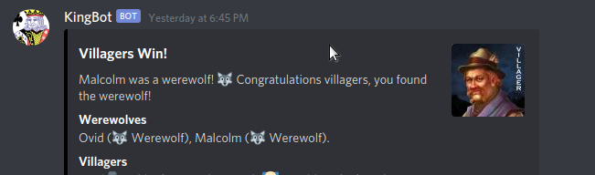

# KingBot-Java
KingBot Java Edition is a ground-up rewrite of the KingBot Discord Chat bot in Java using the JDA 4.2.0 library. KingBot Java Edition makes full use of the Object Oriented paradigm, arranging its commands as object implementations of a command interface. KingBot also uses multithreading to accomplish tasks either not possible or not convenient in KingBot's original Javascript implementation.

## Release
A release jar & accompanying data files may be found on the GitHub page https://github.com/Sher0193/KingBot-Java/releases.
